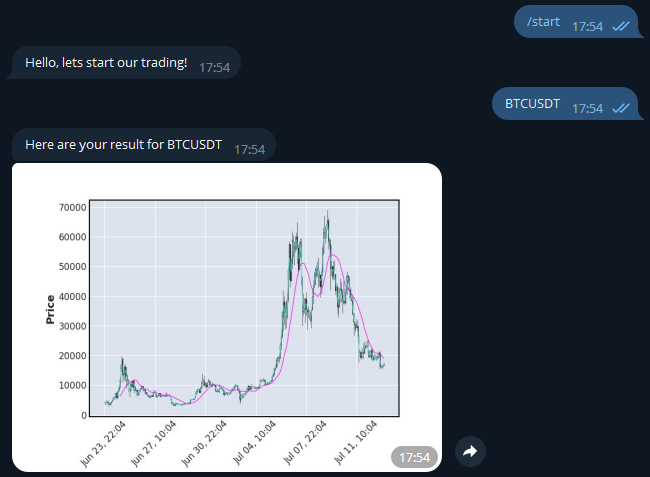

# Telegram bot

This bot uses https://paper-trader.frwd.one/ for calculating your trading profit. You just need to send him correct crypto pair and get an image with the results.

## Installing from GitHub

```
git clone https://github.com/rostyak/tg_bot.git
python -m venv venv

venv\Scripts\activate (on Windows)
source venv/bin/activate (on macOS)

pip install -r requirements.txt

set BOT_TOKEN=token_of_your_bot (on Windows)
export BOT_TOKEN=token_of_your_bot (on macOS)

python main.py
```

## Demo
